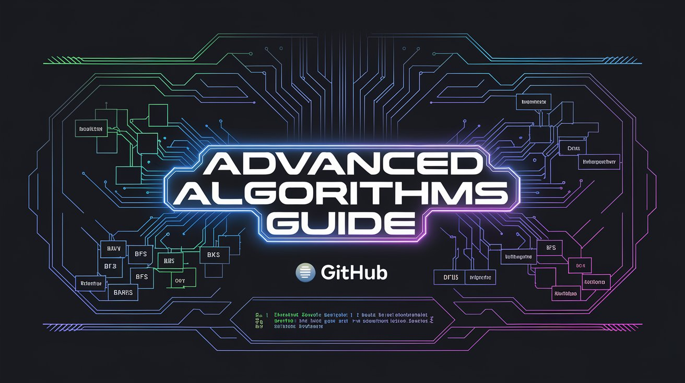

# 🎯 **Advanced Algorithms Guide (VisualAlgoGuide)**

### A Beautiful Collection of Essential Algorithms with Interactive Visualizations

[Getting Started](#getting-started) • 
[Algorithms](#algorithms) • 

---

## 🚀 **Getting Started**

This repository contains a curated collection of the most important algorithms in computer science, complete with:

- 📊 **Interactive visualizations** to understand the algorithms visually.
- 💻 **Clean implementations** for easy integration into your projects.
- 🎯 **Real-world applications** demonstrating the importance of each algorithm.
- ⏱️ **Complexity analysis** for understanding their performance.
- 🔍 **Step-by-step explanations** that break down how the algorithm works.

---

## 📚 **Algorithms**

| Algorithm | Complexity | Category | Documentation |
|:---------:|:---------:|:--------:|:-------------:|
| [Binary Search](./binary-search.md) | -blue) | Searching | [📖](./binary-search.md) |
| [Quick Sort](./quick-sort.md) | -green) | Sorting | [📖](./quick-sort.md) |
| [BFS](./breadth-first-search.md) | -orange) | Graph | [📖](./breadth-first-search.md) |
| [DFS](./depth-first-search.md) | -orange) | Graph | [📖](./depth-first-search.md) |
| [Dijkstra](./dijkstra.md) | log%20V)-red) | Pathfinding | [📖](./dijkstra.md) |

---

## 🌟 **Features**

- **Interactive Visualizations**: Engage with interactive diagrams that visually explain the algorithm's behavior.
- **Multiple Languages**: Find implementations in your favorite programming languages.
- **Time Complexity**: Learn about the time and space complexity for each algorithm.
- **Real-world Applications**: Discover where each algorithm is used in real-world scenarios.
- **Step-by-Step Explanations**: Understand the internal workings with easy-to-follow explanations.

---

 Authored by <strong>Amirhossein Dehghaniazar</strong>

